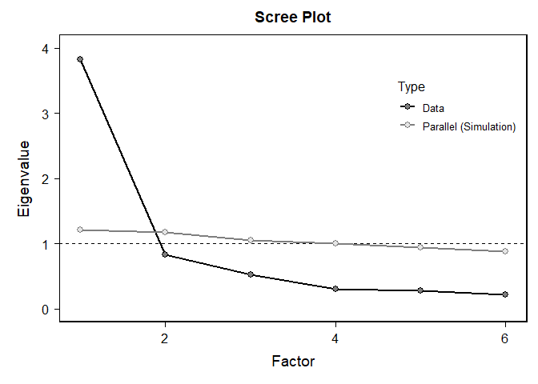
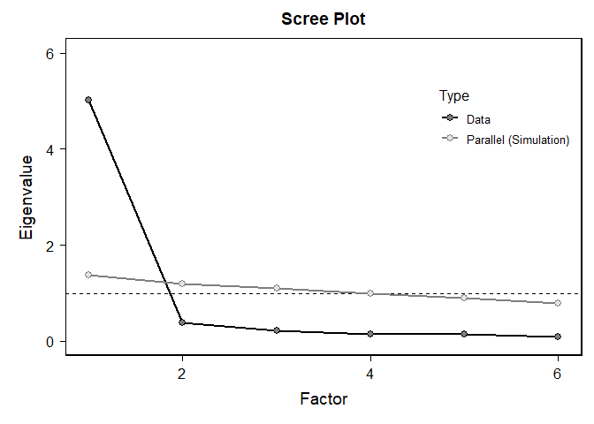
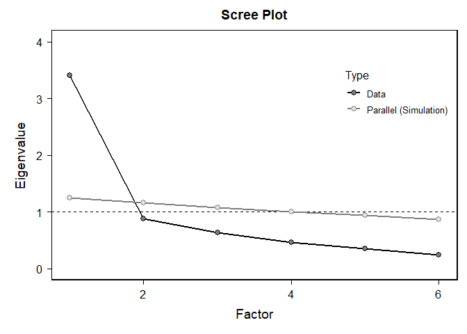

Lab9
================
Sidney Spilfogel
2024-11-07

``` r
library(tidyverse)
```

    ## ── Attaching core tidyverse packages ──────────────────────── tidyverse 2.0.0 ──
    ## ✔ dplyr     1.1.4     ✔ readr     2.1.5
    ## ✔ forcats   1.0.0     ✔ stringr   1.5.1
    ## ✔ ggplot2   3.5.1     ✔ tibble    3.2.1
    ## ✔ lubridate 1.9.3     ✔ tidyr     1.3.1
    ## ✔ purrr     1.0.2     
    ## ── Conflicts ────────────────────────────────────────── tidyverse_conflicts() ──
    ## ✖ dplyr::filter() masks stats::filter()
    ## ✖ dplyr::lag()    masks stats::lag()
    ## ℹ Use the conflicted package (<http://conflicted.r-lib.org/>) to force all conflicts to become errors

``` r
library(bruceR)
```

    ## 
    ## bruceR (v2024.6)
    ## Broadly Useful Convenient and Efficient R functions
    ## 
    ## Packages also loaded:
    ## ✔ data.table ✔ emmeans
    ## ✔ dplyr      ✔ lmerTest
    ## ✔ tidyr      ✔ effectsize
    ## ✔ stringr    ✔ performance
    ## ✔ ggplot2    ✔ interactions
    ## 
    ## Main functions of `bruceR`:
    ## cc()             Describe()  TTEST()
    ## add()            Freq()      MANOVA()
    ## .mean()          Corr()      EMMEANS()
    ## set.wd()         Alpha()     PROCESS()
    ## import()         EFA()       model_summary()
    ## print_table()    CFA()       lavaan_summary()
    ## 
    ## For full functionality, please install all dependencies:
    ## install.packages("bruceR", dep=TRUE)
    ## 
    ## Online documentation:
    ## https://psychbruce.github.io/bruceR
    ## 
    ## To use this package in publications, please cite:
    ## Bao, H.-W.-S. (2024). bruceR: Broadly useful convenient and efficient R functions (Version 2024.6) [Computer software]. https://CRAN.R-project.org/package=bruceR
    ## 
    ## 
    ## These packages are dependencies of `bruceR` but not installed:
    ## - pacman, openxlsx, ggtext, vars, phia, MuMIn, GGally
    ## 
    ## ***** Install all dependencies *****
    ## install.packages("bruceR", dep=TRUE)

``` r
library(haven)


lab9data<-read_sav("C:/Users/sidne/OneDrive/Documents/GitHub/Lab9/lab9data.sav")
```

<https://www.neellab.ca/uploads/1/2/1/1/121173522/the_fundamental_social_motives_inventory.pdf>

# Reliability

``` r
#Option 1: 
#The traditional way is to recode your items first, then use the recoded items to test reliability

lab9data$FSMI3_R <- 8 - lab9data$FSMI3 #recoding reverse coded - use 8 bc scale is 1 to 7 
#lab9data$FSMI57_R <- 8 - lab9data$FSMI57
#lab9data$FSMI58_R <- 8 - lab9data$FSMI58

#If you use the unrecoded items, it will mess up the Cronbach's alpha and lead you to draw wrong conclusion

Alpha(lab9data, "FSMI", c("1", "2", "3_R", "4", "5", "6")) #c is number of items 
```

    ## 
    ## Reliability Analysis
    ## 
    ## Summary:
    ## Total Items: 6
    ## Scale Range: 1 ~ 7
    ## Total Cases: 300
    ## Valid Cases: 297 (99.0%)
    ## 
    ## Scale Statistics:
    ## Mean = 4.535
    ## S.D. = 1.318
    ## Cronbach’s α = 0.873
    ## McDonald’s ω = 0.887
    ## 
    ## Item Statistics (Cronbach’s α If Item Deleted):
    ## ──────────────────────────────────────────────────
    ##           Mean    S.D. Item-Rest Cor. Cronbach’s α
    ## ──────────────────────────────────────────────────
    ## FSMI1    4.148 (1.722)          0.776        0.833
    ## FSMI2    4.943 (1.468)          0.729        0.845
    ## FSMI3_R  4.512 (1.835)          0.367        0.906
    ## FSMI4    4.185 (1.848)          0.749        0.838
    ## FSMI5    4.458 (1.696)          0.791        0.831
    ## FSMI6    4.966 (1.500)          0.708        0.847
    ## ──────────────────────────────────────────────────
    ## Item-Rest Cor. = Corrected Item-Total Correlation

``` r
#Option 2:
#If you don't want to recode your variable, you can use the shortcut below
Alpha(lab9data, "FSMI", 1:6, rev = 3) 
```

    ## 
    ## Reliability Analysis
    ## 
    ## Summary:
    ## Total Items: 6
    ## Scale Range: 1 ~ 7
    ## Total Cases: 300
    ## Valid Cases: 297 (99.0%)
    ## 
    ## Scale Statistics:
    ## Mean = 4.535
    ## S.D. = 1.318
    ## Cronbach’s α = 0.873
    ## McDonald’s ω = 0.887
    ## 
    ## Item Statistics (Cronbach’s α If Item Deleted):
    ## ──────────────────────────────────────────────────────
    ##               Mean    S.D. Item-Rest Cor. Cronbach’s α
    ## ──────────────────────────────────────────────────────
    ## FSMI1        4.148 (1.722)          0.776        0.833
    ## FSMI2        4.943 (1.468)          0.729        0.845
    ## FSMI3 (rev)  4.512 (1.835)          0.367        0.906
    ## FSMI4        4.185 (1.848)          0.749        0.838
    ## FSMI5        4.458 (1.696)          0.791        0.831
    ## FSMI6        4.966 (1.500)          0.708        0.847
    ## ──────────────────────────────────────────────────────
    ## Item-Rest Cor. = Corrected Item-Total Correlation

# Exploratory Factor Analysis

``` r
#In factor analysis, using reverse scored items or not does not make a difference in interpretation. If you use unrecoded items, it will just make the loadings negative 

#EFA on self perception

EFA(lab9data, "FSMI", 1:6, rev = 3, method = "pa", plot.scree = TRUE, nfactors = c("parallel")) #shows that there is only one factor, scale is okay - 1 item not a good predictor PA1 < 0.4
```

    ## 
    ## Explanatory Factor Analysis
    ## 
    ## Summary:
    ## Total Items: 6
    ## Scale Range: 1 ~ 7
    ## Total Cases: 300
    ## Valid Cases: 297 (99.0%)
    ## 
    ## Extraction Method:
    ## - Principal Axis Factor Analysis
    ## Rotation Method:
    ## - (Only one component was extracted. The solution was not rotated.)
    ## 
    ## KMO and Bartlett's Test:
    ## - Kaiser-Meyer-Olkin (KMO) Measure of Sampling Adequacy: MSA = 0.875
    ## - Bartlett's Test of Sphericity: Approx. χ²(15) = 1006.50, p < 1e-99 ***
    ## 
    ## Total Variance Explained:
    ## ───────────────────────────────────────────────────────────────────────────────
    ##           Eigenvalue Variance % Cumulative % SS Loading Variance % Cumulative %
    ## ───────────────────────────────────────────────────────────────────────────────
    ## Factor 1       3.827     63.786       63.786      3.470     57.834       57.834
    ## Factor 2       0.833     13.883       77.669                                   
    ## Factor 3       0.532      8.871       86.540                                   
    ## Factor 4       0.306      5.105       91.645                                   
    ## Factor 5       0.277      4.621       96.266                                   
    ## Factor 6       0.224      3.734      100.000                                   
    ## ───────────────────────────────────────────────────────────────────────────────
    ## 
    ## Factor Loadings (Sorted by Size):
    ## ──────────────────────────────
    ##                PA1 Communality
    ## ──────────────────────────────
    ## FSMI5        0.868       0.754
    ## FSMI1        0.844       0.712
    ## FSMI4        0.801       0.641
    ## FSMI2        0.788       0.621
    ## FSMI6        0.771       0.594
    ## FSMI3 (rev)  0.384       0.147
    ## ──────────────────────────────
    ## Communality = Sum of Squared (SS) Factor Loadings
    ## (Uniqueness = 1 - Communality)

<!-- --> \# Now test
reliability for the status seeking subscale

``` r
Alpha(lab9data, "FSMI", 31:36, rev = 36) 
```

    ## 
    ## Reliability Analysis
    ## 
    ## Summary:
    ## Total Items: 6
    ## Scale Range: 1 ~ 7
    ## Total Cases: 300
    ## Valid Cases: 296 (98.7%)
    ## 
    ## Scale Statistics:
    ## Mean = 3.781
    ## S.D. = 1.246
    ## Cronbach’s α = 0.830
    ## McDonald’s ω = 0.840
    ## 
    ## Item Statistics (Cronbach’s α If Item Deleted):
    ## ───────────────────────────────────────────────────────
    ##                Mean    S.D. Item-Rest Cor. Cronbach’s α
    ## ───────────────────────────────────────────────────────
    ## FSMI31        3.473 (1.733)          0.715        0.778
    ## FSMI32        3.686 (1.885)          0.628        0.798
    ## FSMI33        3.878 (1.673)          0.736        0.775
    ## FSMI34        3.713 (1.649)          0.701        0.782
    ## FSMI35        4.807 (1.603)          0.549        0.813
    ## FSMI36 (rev)  3.128 (1.602)          0.302        0.858
    ## ───────────────────────────────────────────────────────
    ## Item-Rest Cor. = Corrected Item-Total Correlation

# Q1: What is the Cronbach’s alpha of this subscale? Is it a reliable measure of status seeking? Why?

The Chronbach’s alpha for the status seeking sub scale is 0.830. This is
a reliable measure of status seeking because the chronmach alpha is
within the acceptable range that the measure has good reliability.

# Now run a factor analysis on the Mate Retention (Breakup Concern) subscale

``` r
EFA(lab9data, "FSMI", 49:54, rev = FALSE, method = "pa", plot.scree = TRUE, nfactors = c("parallel"))
```

    ## 
    ## Explanatory Factor Analysis
    ## 
    ## Summary:
    ## Total Items: 6
    ## Scale Range: 1 ~ 7
    ## Total Cases: 300
    ## Valid Cases: 206 (68.7%)
    ## 
    ## Extraction Method:
    ## - Principal Axis Factor Analysis
    ## Rotation Method:
    ## - (Only one component was extracted. The solution was not rotated.)
    ## 
    ## KMO and Bartlett's Test:
    ## - Kaiser-Meyer-Olkin (KMO) Measure of Sampling Adequacy: MSA = 0.905
    ## - Bartlett's Test of Sphericity: Approx. χ²(15) = 1434.86, p < 1e-99 ***
    ## 
    ## Total Variance Explained:
    ## ───────────────────────────────────────────────────────────────────────────────
    ##           Eigenvalue Variance % Cumulative % SS Loading Variance % Cumulative %
    ## ───────────────────────────────────────────────────────────────────────────────
    ## Factor 1       5.015     83.578       83.578      4.823     80.378       80.378
    ## Factor 2       0.386      6.436       90.014                                   
    ## Factor 3       0.213      3.549       93.563                                   
    ## Factor 4       0.153      2.548       96.111                                   
    ## Factor 5       0.139      2.313       98.424                                   
    ## Factor 6       0.095      1.576      100.000                                   
    ## ───────────────────────────────────────────────────────────────────────────────
    ## 
    ## Factor Loadings (Sorted by Size):
    ## ─────────────────────────
    ##           PA1 Communality
    ## ─────────────────────────
    ## FSMI51  0.940       0.883
    ## FSMI52  0.928       0.861
    ## FSMI50  0.899       0.809
    ## FSMI49  0.893       0.797
    ## FSMI54  0.892       0.795
    ## FSMI53  0.823       0.678
    ## ─────────────────────────
    ## Communality = Sum of Squared (SS) Factor Loadings
    ## (Uniqueness = 1 - Communality)

<!-- -->

# Q2: How many factors can you identify from the results? Based on what? What is the range of the factor loadings? What is item that has the highest factor loading? In conclusion, is this a good measure of break up concern and why?

There is only one factor for male retention (breakup concern). This is
based on only one factor having an Eigenvalue \> 1 (5.015), also because
the scree plot only has one factor before it levels off and only one
factor above the parallel simulation line. The range of factor loading
is 0.823-0.940 with FSMI51 having the highest factor loading “I worry
that my romantic/sexual partner might leave me.”. In conclusion this is
a good measure of break up concern because all of the factor loadings
are above good cut off of 0.6.

# Q3: Pick another subscale from FSMI. Test reliability and factor analysis. Answer all the questions above.

``` r
Alpha(lab9data, "FSMI", 13:18, rev = 16) 
```

    ## 
    ## Reliability Analysis
    ## 
    ## Summary:
    ## Total Items: 6
    ## Scale Range: 1 ~ 7
    ## Total Cases: 300
    ## Valid Cases: 296 (98.7%)
    ## 
    ## Scale Statistics:
    ## Mean = 4.551
    ## S.D. = 1.202
    ## Cronbach’s α = 0.836
    ## McDonald’s ω = 0.848
    ## 
    ## Item Statistics (Cronbach’s α If Item Deleted):
    ## ───────────────────────────────────────────────────────
    ##                Mean    S.D. Item-Rest Cor. Cronbach’s α
    ## ───────────────────────────────────────────────────────
    ## FSMI13        3.963 (1.749)          0.686        0.793
    ## FSMI14        4.774 (1.542)          0.751        0.781
    ## FSMI15        4.527 (1.624)          0.772        0.775
    ## FSMI16 (rev)  4.233 (1.818)          0.389        0.858
    ## FSMI17        4.794 (1.508)          0.594        0.813
    ## FSMI18        5.014 (1.459)          0.519        0.826
    ## ───────────────────────────────────────────────────────
    ## Item-Rest Cor. = Corrected Item-Total Correlation

``` r
EFA(lab9data, "FSMI", 13:18, rev = 16, method = "pa", plot.scree = TRUE, nfactors = c("parallel"))
```

    ## 
    ## Explanatory Factor Analysis
    ## 
    ## Summary:
    ## Total Items: 6
    ## Scale Range: 1 ~ 7
    ## Total Cases: 300
    ## Valid Cases: 296 (98.7%)
    ## 
    ## Extraction Method:
    ## - Principal Axis Factor Analysis
    ## Rotation Method:
    ## - (Only one component was extracted. The solution was not rotated.)
    ## 
    ## KMO and Bartlett's Test:
    ## - Kaiser-Meyer-Olkin (KMO) Measure of Sampling Adequacy: MSA = 0.845
    ## - Bartlett's Test of Sphericity: Approx. χ²(15) = 740.14, p < 1e-99 ***
    ## 
    ## Total Variance Explained:
    ## ───────────────────────────────────────────────────────────────────────────────
    ##           Eigenvalue Variance % Cumulative % SS Loading Variance % Cumulative %
    ## ───────────────────────────────────────────────────────────────────────────────
    ## Factor 1       3.405     56.742       56.742      2.970     49.493       49.493
    ## Factor 2       0.885     14.744       71.487                                   
    ## Factor 3       0.643     10.717       82.204                                   
    ## Factor 4       0.462      7.694       89.898                                   
    ## Factor 5       0.358      5.969       95.868                                   
    ## Factor 6       0.248      4.132      100.000                                   
    ## ───────────────────────────────────────────────────────────────────────────────
    ## 
    ## Factor Loadings (Sorted by Size):
    ## ───────────────────────────────
    ##                 PA1 Communality
    ## ───────────────────────────────
    ## FSMI15        0.854       0.729
    ## FSMI14        0.833       0.694
    ## FSMI13        0.778       0.606
    ## FSMI17        0.665       0.442
    ## FSMI18        0.564       0.318
    ## FSMI16 (rev)  0.427       0.182
    ## ───────────────────────────────
    ## Communality = Sum of Squared (SS) Factor Loadings
    ## (Uniqueness = 1 - Communality)

<!-- --> \# Q1: What is
the Cronbach’s alpha of this subscale? Is it a reliable measure of
affiliation (group)? Why?

The Chronbach’s alpha for the affliation (group) sub-scale is 0.836.
This is a good measure of group affiliation because the alpha is above
0.8 which is the criteria for a good reliable measure.

# Q2: How many factors can you identify from the results? Based on what? What is the range of the factor loadings? What is item that has the highest factor loading? In conclusion, is this a good measure of group affliation and why?

There is one factor for this sub-scale. This is shown by only one factor
having an eigenvalue above 1 (3.405), only one factor that is on the
slope of the scree plot, and only one factor above the parallel
simulation line. The range of factor loading’s are 0.427-0.854 where
FSMI15 is the highest factor “I like being part of a team”. In
conclusion this is a okay measure of group affiliation because all the
factor loading are above 0.4 which is the acceptable cutoff, two are
within the acceptable range of 0.4-0.6, and the rest are above the good
cutoff of 0.6.
